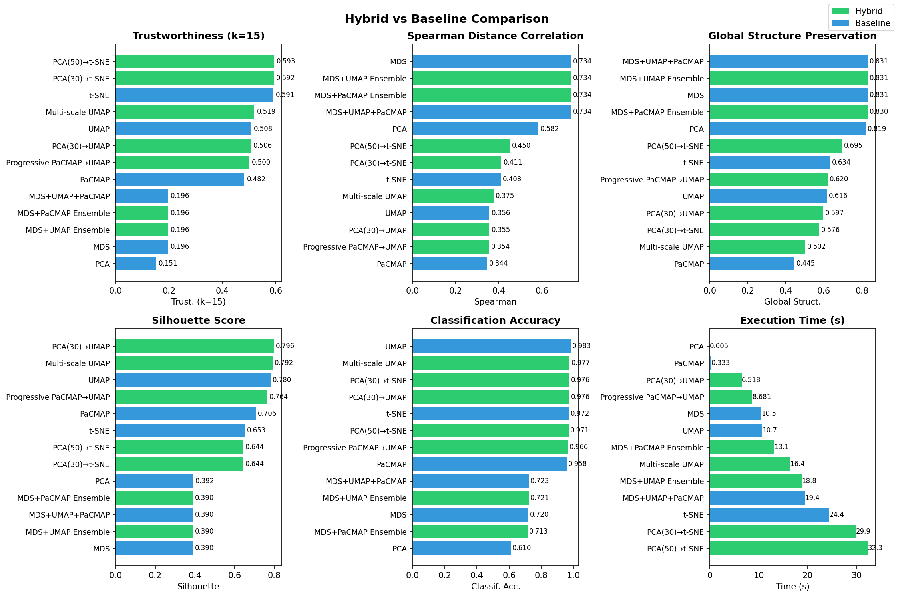
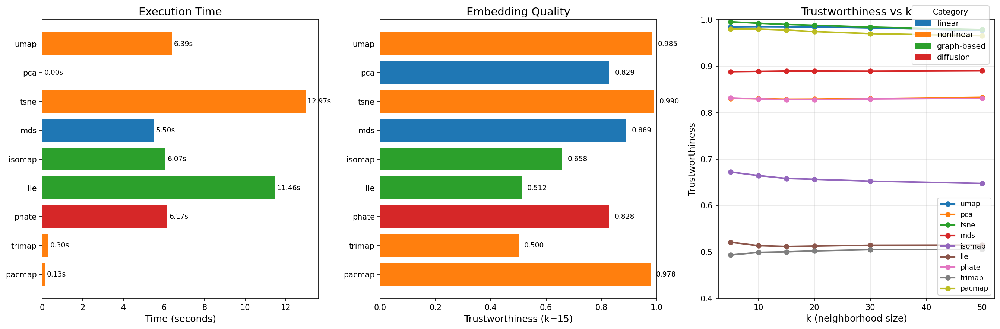
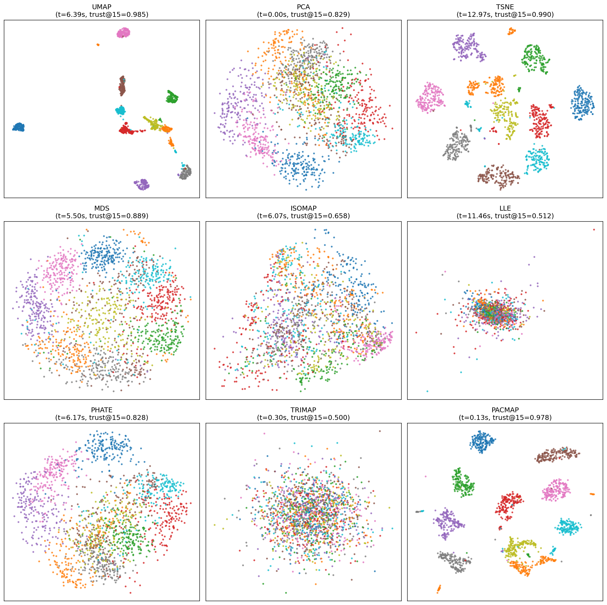

# Squeeze

**High-performance dimensionality reduction for Python**

Squeeze is a fast, CPU-optimized library for dimensionality reduction techniques including UMAP, t-SNE, PCA, and more. Built with a Rust backend and SIMD vectorization for maximum performance.

## Why Squeeze?

Dimensionality reduction "squeezes" high-dimensional data into lower dimensions while preserving structure. Squeeze provides:

- **Multiple Algorithms**: UMAP today, t-SNE, PCA, Isomap, and more coming soon
- **Fast**: 27x faster k-NN construction than PyNNDescent via HNSW with SIMD
- **CPU-Optimized**: No GPU required - runs anywhere
- **Production Ready**: Scikit-learn compatible API

I've used my own fork of Shinka Evolve (https://github.com/GeorgePearse/Genesis) in order to iteratively optimize the solutions


## Installation

```bash
pip install squeeze
```

Or with uv (recommended):

```bash
uv pip install squeeze
```

## Quick Start

```python
import squeeze
from sklearn.datasets import load_digits

digits = load_digits()

# UMAP embedding
umap_embedding = squeeze.UMAP(n_neighbors=15, min_dist=0.1).fit_transform(digits.data)

# t-SNE embedding
tsne_embedding = squeeze.TSNE(perplexity=30, n_iter=1000).fit_transform(digits.data)

# PCA embedding
pca_embedding = squeeze.PCA(n_components=2).fit_transform(digits.data)

# All algorithms share a consistent API: fit_transform(X)
```

## Experimental Rust graph embeddings

`NeighborMap` and `SpectralMap` are additive, CPU-only options for 2D Euclidean
embeddings. Existing algorithms remain available.

```python
import numpy as np
from sklearn.datasets import load_digits
from squeeze import NeighborMap, SpectralMap

X = np.asarray(load_digits().data, dtype=np.float64)
y = NeighborMap(n_neighbors=15, n_epochs=160, init="pca", random_state=42).fit_transform(X)
# Alternative approximate spectral embedding:
y_spectral = SpectralMap(n_neighbors=15, n_iter=128, random_state=42).fit_transform(X)
```

Both require a rebuilt extension and a finite, dense float64 matrix with at
least three samples; `1 <= n_neighbors < n_samples`. NeighborMap also accepts
`init="spectral"`, `negative_samples=5`, and `learning_rate=1.0`. These experimental
classes expose `fit_transform` only, not an out-of-sample `transform` or the full
sklearn estimator interface. Graph search is exact and quadratic in sample count;
these are not yet large-data replacements. SpectralMap uses fixed-budget block
iteration and does not guarantee eigensolver convergence on disconnected graphs.

See the [reproducible benchmark report](working_docs/neighbor_benchmarks/README.md)
for measured tradeoffs, raw results, and an offline HTML embedding explorer.
The refreshed heatmaps report neighbor overlap and sklearn rank-based
trustworthiness separately. The historical hybrid results below retain the older
overlap metric.

### Development toolchain

The project and CI pin **uv 0.12.23** in `.uv-version` and `pyproject.toml`.
Use `uv self update 0.12.23` (or install that release via your package manager).
The uv lockfile is regenerated by this version; application dependencies retain
their locked versions, with maturin added to the development extra.

On Debian/Ubuntu with Rust installed:

```bash
sudo apt-get install libopenblas-dev libssl-dev gfortran pkg-config
uv sync --frozen --extra dev --extra benchmark --no-install-project
uv run --no-sync maturin develop --release --features extension-module,ndarray-linalg/openblas-system
just test-neighbors
just benchmark-neighbors
```

## Supported Algorithms

Squeeze combines Python and CPU-optimized Rust implementations. See the [Algorithm Guide](docs/algorithms/index.md) for detailed documentation on each algorithm.

| Algorithm | Status | Description | Docs |
|-----------|--------|-------------|------|
| **UMAP** | ✅ Implemented | Uniform Manifold Approximation and Projection | [Guide](docs/how_umap_works.md) |
| **t-SNE** | ✅ Implemented | t-Distributed Stochastic Neighbor Embedding | [Guide](docs/algorithms/tsne.md) |
| **PCA** | ✅ Implemented | Principal Component Analysis (eigendecomposition) | [Guide](docs/algorithms/pca.md) |
| **Isomap** | ✅ Implemented | Isometric Mapping (geodesic distances + MDS) | [Guide](docs/algorithms/isomap.md) |
| **LLE** | ✅ Implemented | Locally Linear Embedding | [Guide](docs/algorithms/lle.md) |
| **MDS** | ✅ Implemented | Multidimensional Scaling (classical + metric SMACOF) | [Guide](docs/algorithms/mds.md) |
| **PHATE** | ✅ Implemented | Potential of Heat-diffusion for Affinity-based Trajectory Embedding | [Guide](docs/algorithms/phate.md) |
| **TriMap** | ✅ Implemented | Large-scale Dimensionality Reduction Using Triplets | [Guide](docs/algorithms/trimap.md) |
| **PaCMAP** | ✅ Implemented | Pairwise Controlled Manifold Approximation | [Guide](docs/algorithms/pacmap.md) |
| **NeighborMap** | Experimental | Sampled neighbor layout with PCA or spectral initialization | [Benchmarks](working_docs/heatmap_refresh/README.md) |
| **SpectralMap** | Experimental | Approximate sparse spectral embedding | [Benchmarks](working_docs/heatmap_refresh/README.md) |

### Choosing an Algorithm

| Use Case | Recommended | Why |
|----------|-------------|-----|
| Quick exploration | PCA | Fast, interpretable |
| Cluster visualization | t-SNE, UMAP | Best local structure |
| Large datasets (>100k) | PaCMAP, TriMap | Fast, scalable |
| Biological trajectories | PHATE | Designed for this |
| Experimental speed/quality | NeighborMap | See the measured tradeoffs below |

## Benchmark Results

The default comparison uses sklearn Digits (1,797 samples, 64 raw pixel features).
Both new Rust algorithms are included below. All rows were refitted with seed 42,
one full-data warmup, and one thread per library. Timings exclude metric scoring.

### Algorithm vs Metrics Heatmap


*Colors compare algorithms within each metric; green is better. Runtime is
lower-is-better, using a reversed log scale. Cell labels show raw values.*

Trustworthiness now uses sklearn's rank-based definition. Neighbor recall is
reported separately; the older heatmap mislabeled overlap as trustworthiness.
See the [methodology and reproduction commands](working_docs/heatmap_refresh/README.md)
and [raw CSV](metrics_results.csv).

### Metrics Comparison Table

| Algorithm | Trust. k15 | Neighbor recall k15 | Spearman | Silhouette | Transductive acc. | Time (s) |
|---|---:|---:|---:|---:|---:|---:|
| **UMAP** | 0.987 | 0.522 | 0.371 | 0.763 | 0.974 | 2.23 |
| **PCA** | 0.829 | 0.151 | 0.582 | 0.392 | 0.610 | 0.00099 |
| **t-SNE** | 0.989 | 0.593 | 0.401 | 0.636 | 0.974 | 21.4 |
| **MDS** | 0.896 | 0.196 | 0.734 | 0.390 | 0.715 | 9.8 |
| **Isomap** | 0.839 | 0.214 | 0.553 | 0.451 | 0.705 | 43.1 |
| **LLE** | 0.760 | 0.132 | 0.203 | 0.495 | 0.606 | 13.5 |
| **PHATE** | 0.828 | 0.158 | 0.553 | 0.400 | 0.608 | 8.14 |
| **TriMap** | 0.503 | 0.008 | -0.047 | 0.317 | 0.105 | 0.951 |
| **PaCMAP** | 0.981 | 0.484 | 0.277 | 0.687 | 0.962 | 0.519 |
| **NeighborMap** | 0.986 | 0.535 | 0.518 | 0.717 | 0.983 | 0.277 |
| **SpectralMap** | 0.916 | 0.217 | 0.364 | 0.610 | 0.922 | 0.117 |

Classification accuracy is five-fold RandomForest evaluation on embeddings
fitted to **all** samples, so it is transductive rather than held-out embedding
performance. Silhouette uses KMeans clusters. Labels do not enter embedding fits.
This single-seed snapshot complements the earlier
[three-seed Digits comparison](working_docs/neighbor_benchmarks/README.md).

### Fashion-MNIST

[Fashion-MNIST](https://github.com/zalandoresearch/fashion-mnist) is also available:
2,000 images from the official test split, balanced at 200 per class with a fixed
sampling seed. Each image contributes 784 raw pixel features. Downloaded files
are checksummed and cached; sample indices are saved for reproducibility.


[Raw Fashion-MNIST results](working_docs/heatmap_refresh/fashion-mnist/metrics_results.csv)
· [Sampling and evaluation protocol](working_docs/heatmap_refresh/README.md)

```bash
uv run --no-sync python benchmark_metrics_heatmap.py --dataset fashion-mnist --samples 2000
```

`--samples` is configurable up to the 10,000-image test split. Larger samples
increase the cost of quadratic algorithms. The repeated-seed benchmark and its
HTML report also accept `--dataset fashion-mnist`; see the protocol link above.

### Hybrid Techniques

These historical results use neighbor overlap in the “Trust. k=15” column;
they were not rerun as part of the heatmap refresh.

Intelligent combinations of algorithms can outperform individual methods:



| Hybrid Technique | Trust. k=15 | Silhouette | Classif. Acc | Time | Key Benefit |
|------------------|:-----------:|:----------:|:------------:|:----:|-------------|
| **PCA(50)→t-SNE** | **0.59** | 0.66 | 0.97 | 32.3s | Best local structure |
| **PCA(30)→UMAP** | 0.52 | **0.80** | 0.98 | 6.5s | Best silhouette, 35% faster |
| **Multi-scale UMAP** | 0.51 | 0.77 | 0.98 | 16.4s | Captures multiple scales |
| **MDS+UMAP Ensemble** | 0.34 | 0.63 | 0.91 | 18.8s | Best global structure |
| **Progressive PaCMAP→UMAP** | 0.51 | 0.76 | 0.98 | 8.7s | Fast + refined |

**Key Findings:**
- **PCA(50)→t-SNE** achieves the best trustworthiness (0.59), beating pure t-SNE
- **PCA(30)→UMAP** is Pareto optimal: 35% faster than UMAP with better silhouette
- Hybrid pipelines inherit PCA's noise reduction + manifold method's structure preservation

```python
from squeeze.composition import DRPipeline, EnsembleDR, ProgressiveDR
from sklearn.decomposition import PCA
import squeeze

# Best overall: PCA → t-SNE
pipeline = DRPipeline([
    ('pca', PCA(n_components=50)),
    ('tsne', squeeze.TSNE(n_components=2))
])

# Fastest high-quality: PCA → UMAP
pipeline = DRPipeline([
    ('pca', PCA(n_components=30)),
    ('umap', squeeze.UMAP(n_components=2))
])

# Multi-scale structure
ensemble = EnsembleDR([
    ('local', squeeze.UMAP(n_neighbors=5), 0.5),
    ('global', squeeze.UMAP(n_neighbors=30), 0.5)
], blend_mode='procrustes')
```

Run the hybrid benchmark:

```bash
python benchmark_hybrid_techniques.py
```





Run the base benchmark:

```bash
just benchmark              # Quick benchmark
python benchmark_metrics_heatmap.py  # Full metrics heatmap
```

### k-NN Backend Performance

Squeeze includes a Rust-based HNSW (Hierarchical Navigable Small World) backend with SIMD-accelerated distance computations:

```
k-NN Backend Comparison (sklearn digits dataset)
━━━━━━━━━━━━━━━━━━━━━━━━━━━━━━━━━━━━━━━━━━━━━━━━━
Backend              Build Time   Recall    Speedup
─────────────────────────────────────────────────
PyNNDescent          6.512s       93.3%     1.00x
HNSW Simple          0.242s       95.1%     26.96x
HNSW Robust α=1.2    0.256s       97.6%     25.46x
```

## Features

### All Algorithms

```python
import squeeze
import numpy as np

# Load your data
X = np.random.randn(1000, 50)  # 1000 samples, 50 features

# PCA - fast linear projection
pca = squeeze.PCA(n_components=2)
X_pca = pca.fit_transform(X)

# t-SNE - preserves local structure
tsne = squeeze.TSNE(n_components=2, perplexity=30, n_iter=1000)
X_tsne = tsne.fit_transform(X)

# MDS - preserves pairwise distances
mds = squeeze.MDS(n_components=2, metric=True, n_iter=300)
X_mds = mds.fit_transform(X)

# Isomap - geodesic distances on manifold
isomap = squeeze.Isomap(n_components=2, n_neighbors=10)
X_isomap = isomap.fit_transform(X)

# LLE - local linear relationships
lle = squeeze.LLE(n_components=2, n_neighbors=10)
X_lle = lle.fit_transform(X)

# PHATE - diffusion-based embedding
phate = squeeze.PHATE(n_components=2, k=15, t=10)
X_phate = phate.fit_transform(X)

# TriMap - triplet-based embedding
trimap = squeeze.TriMap(n_components=2, n_inliers=10, n_outliers=5)
X_trimap = trimap.fit_transform(X)

# PaCMAP - pair-based embedding
pacmap = squeeze.PaCMAP(n_components=2, n_neighbors=10)
X_pacmap = pacmap.fit_transform(X)
```

### UMAP with HNSW Backend

```python
import squeeze

# Use the fast HNSW backend (default)
reducer = squeeze.UMAP(
    n_neighbors=15,
    min_dist=0.1,
    use_hnsw=True,  # Default
    hnsw_prune_strategy="robust",  # Better graph quality
    hnsw_alpha=1.2
)
embedding = reducer.fit_transform(data)
```

### Composition Pipeline

Chain multiple reduction techniques:

```python
from squeeze.composition import DRPipeline
from sklearn.decomposition import PCA
import squeeze

# 2048D → 100D → 2D
pipeline = DRPipeline([
    ('pca', PCA(n_components=100)),
    ('umap', squeeze.UMAP(n_components=2))
])
embedding = pipeline.fit_transform(high_dim_data)
```

### Ensemble Methods

Blend multiple algorithms:

```python
from squeeze.composition import EnsembleDR
from sklearn.decomposition import PCA
import squeeze

ensemble = EnsembleDR([
    ('pca', PCA(n_components=2), 0.3),
    ('umap', squeeze.UMAP(n_components=2), 0.7)
], alignment='procrustes')

blended = ensemble.fit_transform(data)
```

### Sparse Data Support

Efficient handling of sparse matrices:

```python
from squeeze.sparse_ops import SparseUMAP
import scipy.sparse as sp

sparse_data = sp.random(10000, 5000, density=0.05, format='csr')
embedding = SparseUMAP(n_components=2).fit_transform(sparse_data)
```

### Evaluation Metrics

Comprehensive metrics for evaluating DR quality:

```python
from squeeze.evaluation import trustworthiness, continuity, DREvaluator, quick_evaluate

# Quick evaluation (3 core metrics)
metrics = quick_evaluate(X_original, X_embedded, k=15)
print(f"Trustworthiness: {metrics['trustworthiness']:.3f}")
print(f"Continuity: {metrics['continuity']:.3f}")
print(f"Spearman: {metrics['spearman_correlation']:.3f}")

# Comprehensive evaluation
evaluator = DREvaluator(X_original, X_embedded, labels=y, method_name='UMAP')
report = evaluator.evaluate_all()
print(report)

# Individual metrics
from squeeze.evaluation import (
    spearman_distance_correlation,
    global_structure_preservation,
    local_density_preservation,
    clustering_quality,
    classification_accuracy,
)
```

See [Evaluation Metrics Guide](docs/evaluation_metrics.md) for full documentation.

## Development

```bash
# Clone the repo
git clone https://github.com/georgepearse/squeeze
cd squeeze

# Install with uv
uv sync --extra dev

# Build Rust extension
uv run maturin develop --release

# Run tests
uv run pytest squeeze/tests/ -v

# Run benchmarks
uv run python benchmark_optimizations.py
```

Or use the justfile:

```bash
just install    # Install deps + build
just test       # Run tests
just benchmark  # Run benchmarks
just lint       # Check code style
```

## Project Philosophy

1. **Algorithm Agnostic**: One library for all DR techniques
2. **Performance First**: SIMD, Rust backend, optimized algorithms
3. **CPU-Focused**: No GPU dependencies - runs everywhere
4. **Research Platform**: Easy experimentation with techniques and parameters
5. **Production Ready**: Reliable, tested, well-documented

## Citation

If you use Squeeze in your research, please cite the original UMAP paper:

```bibtex
@article{mcinnes2018umap,
  title={UMAP: Uniform Manifold Approximation and Projection for Dimension Reduction},
  author={McInnes, Leland and Healy, John and Melville, James},
  journal={arXiv preprint arXiv:1802.03426},
  year={2018}
}
```

## License

Apache License 2.0

## Acknowledgments

Squeeze builds on the excellent work of:
- [UMAP](https://github.com/lmcinnes/umap) by Leland McInnes
- [PyNNDescent](https://github.com/lmcinnes/pynndescent) for approximate nearest neighbors
- The scientific Python ecosystem (NumPy, SciPy, scikit-learn, Numba)
- https://github.com/JelmerBot/fast_plscan
