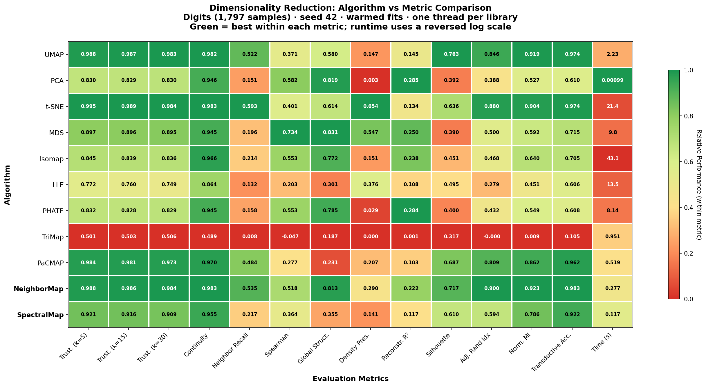
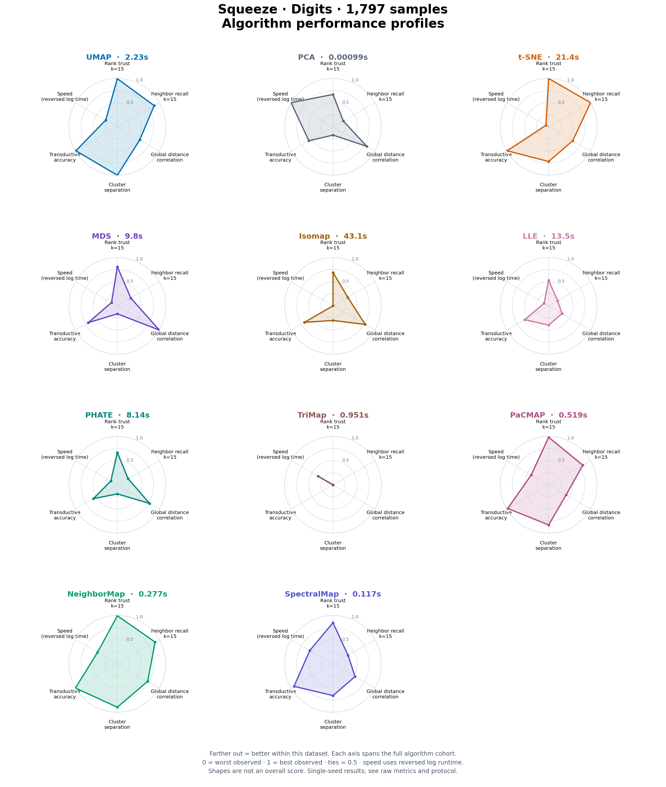
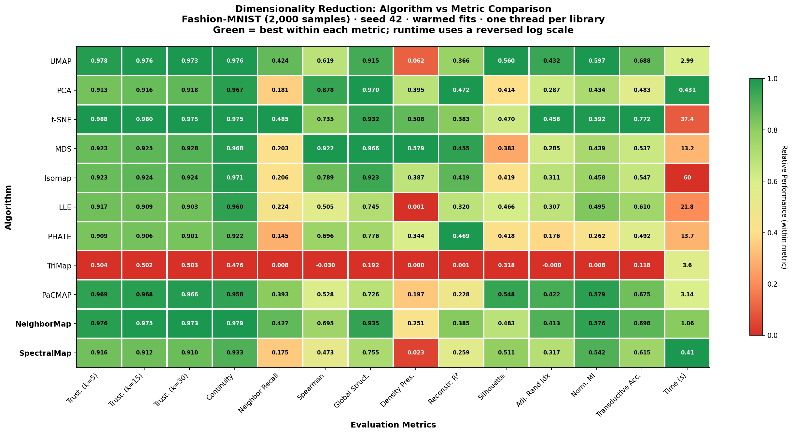

# Squeeze

CPU dimensionality reduction for Python, with UMAP, ten Rust reducers, and
reproducible comparisons on Digits and Fashion-MNIST.

**[Documentation](https://georgepearse.github.io/squeeze/)** ·
[Installation](docs/installation.md) · [Algorithm guide](docs/algorithms/index.md) ·
[API reference](docs/api.md)

Squeeze is an alpha research library. UMAP uses Python/Numba with optional Rust
neighbor search. The other core methods use the compiled Rust extension.
NeighborMap and SpectralMap are experimental additions; existing methods remain
available. APIs differ: UMAP and PCA support fitted transforms, while the other
Rust reducers primarily expose `fit_transform`.

## Build from source

Use Python 3.10, Rust, and **uv 0.12.23**. On Debian/Ubuntu:

```bash
sudo apt-get install libopenblas-dev libssl-dev gfortran pkg-config
git clone https://github.com/GeorgePearse/squeeze.git
cd squeeze
uv sync --frozen --extra dev --extra benchmark --no-install-project
uv run --no-sync maturin develop --release --features extension-module,ndarray-linalg/openblas-system
```

## Quick start

```python
import numpy as np
from sklearn.datasets import load_digits
from squeeze import NeighborMap, PCA

X = np.asarray(load_digits().data, dtype=np.float64)
linear = PCA(n_components=2).fit_transform(X)
embedding = NeighborMap(n_neighbors=15, n_epochs=160, random_state=42).fit_transform(X)
assert embedding.shape == (1797, 2)
```

The graph methods require finite dense float64 input, at least three samples, and
`1 <= n_neighbors < n_samples`. They produce two dimensions using Euclidean
neighbors. Exact graph construction is quadratic; these are not yet large-data
replacements. See [NeighborMap](docs/algorithms/neighbor-map.md) and
[SpectralMap](docs/algorithms/spectral-map.md) for their constraints.

## Algorithms

PCA · UMAP · t-SNE · MDS · Isomap · LLE · PHATE · TriMap · PaCMAP ·
NeighborMap · SpectralMap

The [capability table](docs/algorithms/index.md) documents each implementation and
its transform support. [Composition](docs/composing_models.md),
[out-of-sample interpolation](docs/transform.md), and [streaming](docs/streaming.md)
are separate wrappers with explicit limitations.

## Benchmark Results

The default comparison uses sklearn Digits (1,797 samples, 64 raw pixel features).
Both new Rust algorithms are included below. All rows were refitted with seed 42,
one full-data warmup, and one thread per library. Timings exclude metric scoring.

### Algorithm vs Metrics Heatmap



*Colors compare algorithms within each metric; green is better. Runtime is
lower-is-better, using a reversed log scale. Cell labels show raw values.*

Trustworthiness now uses sklearn's rank-based definition. Neighbor recall is
reported separately; the older heatmap mislabeled overlap as trustworthiness.
See the [methodology and reproduction commands](working_docs/heatmap_refresh/README.md)
and [raw CSV](metrics_results.csv).

### Algorithm performance radars



Farther out means better **relative to the algorithms on this dataset**. The six
axes compare rank trustworthiness, neighbor recall, global distance correlation,
cluster separation, transductive accuracy, and speed (reversed log runtime).
These shapes are not overall scores or absolute capability measurements.

[Interactive Digits and Fashion-MNIST comparisons](https://georgepearse.github.io/squeeze/benchmarking/#circular-performance-profiles)
· [Fashion-MNIST PNG](docs/assets/benchmarks/fashion-mnist-radar/metrics_radar.png)

### Metrics Comparison Table

| Algorithm | Trust. k15 | Neighbor recall k15 | Spearman | Silhouette | Transductive acc. | Time (s) |
|---|---:|---:|---:|---:|---:|---:|
| **UMAP** | 0.987 | 0.522 | 0.371 | 0.763 | 0.974 | 2.23 |
| **PCA** | 0.829 | 0.151 | 0.582 | 0.392 | 0.610 | 0.00099 |
| **t-SNE** | 0.989 | 0.593 | 0.401 | 0.636 | 0.974 | 21.4 |
| **MDS** | 0.896 | 0.196 | 0.734 | 0.390 | 0.715 | 9.8 |
| **Isomap** | 0.839 | 0.214 | 0.553 | 0.451 | 0.705 | 43.1 |
| **LLE** | 0.760 | 0.132 | 0.203 | 0.495 | 0.606 | 13.5 |
| **PHATE** | 0.828 | 0.158 | 0.553 | 0.400 | 0.608 | 8.14 |
| **TriMap** | 0.503 | 0.008 | -0.047 | 0.317 | 0.105 | 0.951 |
| **PaCMAP** | 0.981 | 0.484 | 0.277 | 0.687 | 0.962 | 0.519 |
| **NeighborMap** | 0.986 | 0.535 | 0.518 | 0.717 | 0.983 | 0.277 |
| **SpectralMap** | 0.916 | 0.217 | 0.364 | 0.610 | 0.922 | 0.117 |

Classification accuracy is five-fold RandomForest evaluation on embeddings
fitted to **all** samples, so it is transductive rather than held-out embedding
performance. Silhouette uses KMeans clusters. Labels do not enter embedding fits.
This single-seed snapshot complements the earlier
[three-seed Digits comparison](working_docs/neighbor_benchmarks/README.md).

### Fashion-MNIST

[Fashion-MNIST](https://github.com/zalandoresearch/fashion-mnist) is also available:
2,000 images from the official test split, balanced at 200 per class with a fixed
sampling seed. Each image contributes 784 raw pixel features. Downloaded files
are checksummed and cached; sample indices are saved for reproducibility.



[Raw Fashion-MNIST results](working_docs/heatmap_refresh/fashion-mnist/metrics_results.csv)
· [Sampling and evaluation protocol](working_docs/heatmap_refresh/README.md)

```bash
uv run --no-sync python benchmark_metrics_heatmap.py --dataset fashion-mnist --samples 2000
```

`--samples` is configurable up to the 10,000-image test split. Larger samples
increase the cost of quadratic algorithms. The repeated-seed benchmark and its
HTML report also accept `--dataset fashion-mnist`; see the protocol link above.


## Contributing and attribution

See [Contributing](CONTRIBUTING.md) for tests, documentation builds, and PRs.
Squeeze derives its UMAP code from umap-learn; original authorship and license
notices remain intact. See [credits](docs/credits.md) and [LICENSE](LICENSE.txt).
