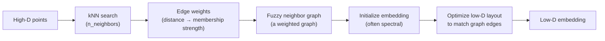
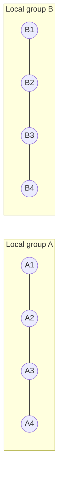
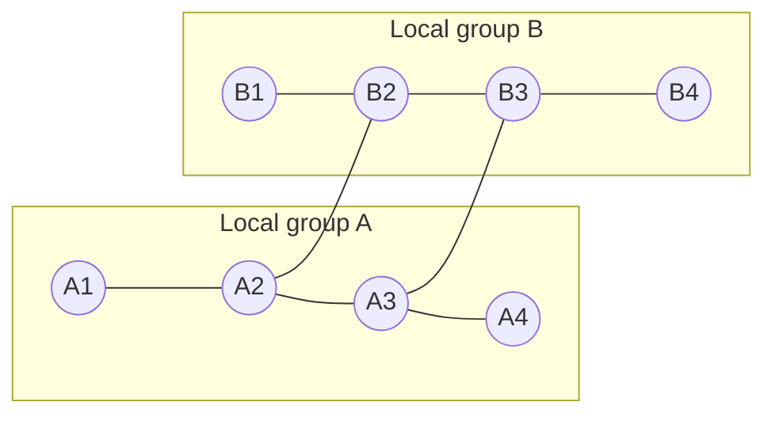
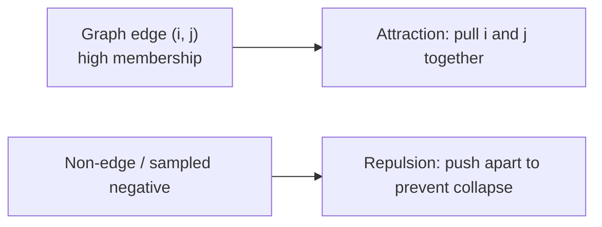
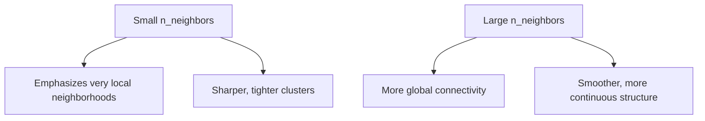
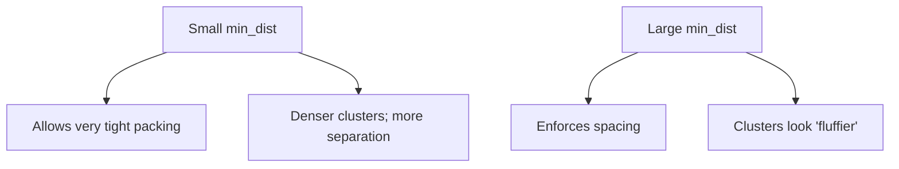
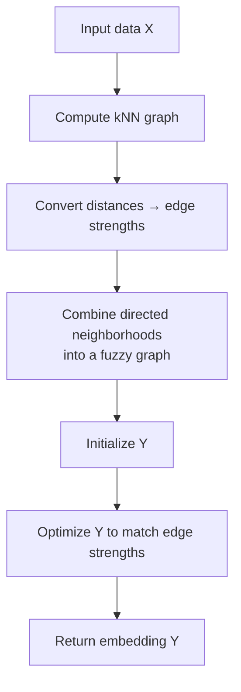

# UMAP (Uniform Manifold Approximation and Projection)

UMAP is a nonlinear dimensionality reduction algorithm that builds a **weighted neighbor graph** in high dimensions and then learns a low-dimensional embedding that best preserves that graph.

If you want the full mathematical deep dive, see: [How UMAP Works](../how_umap_works.md).

## What UMAP is “trying to keep the same”

UMAP is easiest to interpret as preserving **neighbor relationships** (local structure), while still producing a globally coherent layout because neighborhoods must connect consistently.

## Phase 1: Build a fuzzy neighbor graph

UMAP starts with a k-nearest-neighbor graph and converts distances into **edge strengths** (think: “how confident are we that i and j are neighbors?”).

### Visual intuition: the same points, two different neighborhood scales

Small `n_neighbors` builds a *more local* graph; large `n_neighbors` builds a *more connected* graph.

#### Small `n_neighbors` (mostly within local groups)

#### Large `n_neighbors` (adds more cross-group connectivity)

## Phase 2: Lay out the graph in low dimensions

UMAP then learns positions \(y_i\) so that:

- edges with **high** membership strength become **short distances** (attraction),
- non-edges are kept apart (repulsion, often implemented with negative sampling).

### Visual intuition: attraction vs repulsion

## The two knobs you feel the most

### `n_neighbors` (local scale)

### `min_dist` (how tightly points can pack)

## Step-by-step summary

## How to interpret UMAP plots safely

- **Local neighborhoods are meaningful**: if points are close, they were likely neighbors in high-D.
- **Global distances are somewhat meaningful**, but still not a strict metric—don’t over-interpret exact between-cluster spacing.

