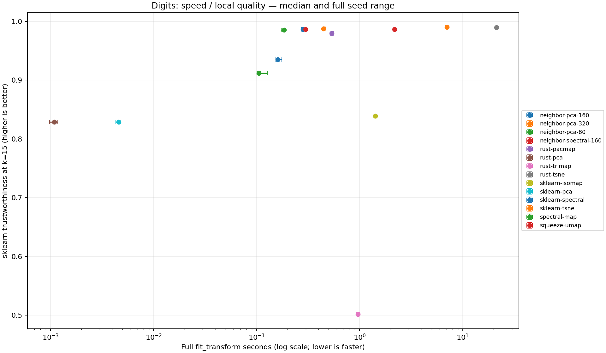

# Rust graph embedding experiments — 2026-10-06

NeighborMap's default PCA initialization / 160 epochs is **1.91x faster** than
this repository's existing Rust PaCMAP and **7.75x faster** than its Python UMAP
on this Digits run. It improves all reported median quality scores over that
PaCMAP implementation and has similar rank trustworthiness to UMAP. This does
not establish a statistically significant quality advantage over UMAP.

PCA remains much faster for a lower-quality 2D projection. Both t-SNE
implementations retain more local neighbors than NeighborMap. SpectralMap is
faster but less accurate than sklearn SpectralEmbedding; retain it as an
experimental initialization/visualization option, not the recommended default.
The very weak TriMap result describes the existing code in this repository,
not the reference TriMap library or the underlying published method.

## Measured results

All **42 fits succeeded**. Median of seeds 17, 29, 53; full ranges in
[summary.json](validation/summary.json). Lower seconds is better; higher quality
scores are better. One Rayon / BLAS / Numba / OpenMP thread, AMD EPYC 7B13 VM,
Python 3.10.17, release Rust build with system OpenBLAS. No other build, test,
or benchmark from this task ran during validation. The host is shared.

| Method | Seconds | Trustworthiness k15 | Neighbor recall k15 | Distance Spearman |
|---|---:|---:|---:|---:|
| neighbor-pca-160 | 0.2816 | 0.9867 | 0.5301 | 0.5079 |
| neighbor-pca-320 | 0.4465 | 0.9877 | 0.5386 | 0.4896 |
| neighbor-pca-80 | 0.1854 | 0.9853 | 0.5162 | 0.5229 |
| neighbor-spectral-160 | 0.2987 | 0.9863 | 0.5309 | 0.3522 |
| rust-pacmap | 0.5368 | 0.9793 | 0.4868 | 0.2460 |
| rust-pca | 0.0011 | 0.8288 | 0.1512 | 0.5775 |
| rust-trimap | 0.9633 | 0.5018 | 0.0089 | -0.0540 |
| rust-tsne | 21.3107 | 0.9896 | 0.5912 | 0.4341 |
| sklearn-isomap | 1.4156 | 0.8391 | 0.2135 | 0.5473 |
| sklearn-pca | 0.0046 | 0.8288 | 0.1512 | 0.5775 |
| sklearn-spectral | 0.1604 | 0.9348 | 0.3268 | 0.3251 |
| sklearn-tsne | 7.0335 | 0.9904 | 0.5919 | 0.5017 |
| spectral-map | 0.1055 | 0.9120 | 0.2141 | 0.3504 |
| squeeze-umap | 2.1815 | 0.9866 | 0.5212 | 0.3485 |



Download [report.html](validation/report.html) and open it locally for the
self-contained interactive explorer (14 methods x 3 seeds). The report includes
method selection, digit labels, parameters, source hashes, all raw runs and
metric ranges. [embeddings.npz](validation/embeddings.npz) stores full-precision
coordinates; HTML coordinates are rounded to five decimals only for display.

## Iteration record

1. Added SpectralMap: locally scaled exact kNN graph, symmetric normalized
   adjacency, deflated block power iteration. Its spectral coordinates are
   approximate and depend on the iteration budget and connected components.
2. Added NeighborMap: the same graph plus PCA or spectral initialization,
   weighted attraction and negative-sampled repulsion. Tested both
   initializations at 80, 160 and 320 epochs on exploration seed 42.
   [Initial raw results](exploration/results.json).
3. Added an opt-in squared-distance SIMD kernel to the shared metric module:
   AVX2 multiply/add with runtime dispatch and scalar fallback; take square roots
   only for the selected k neighbors. Existing algorithm implementations and
   metric entry points are unchanged. [Optimized exploration](optimized_exploration/results.json).
   The optimized exploratory run overlapped a Rust test build, so those timing
   deltas are provisional; final comparisons use the same compiled extension
   and no concurrent task-owned compute.
4. Standardized incoming NumPy memory layout after a Fortran-array test exposed
   layout-dependent PCA rounding propagating through stochastic optimization.
5. Froze choices in [PROTOCOL.md](PROTOCOL.md), then ran the three additional
   seeds. No further tuning used their scores.

NeighborMap is an implementation experiment inspired by graph embeddings and
[UMAP-style sampled optimization](https://arxiv.org/abs/1802.03426), not a claim
of new mathematics or a faithful UMAP port. The sparse graph retains O(n*k)
edges; exact construction still performs O(n*n*d) distance work and temporary
row-distance buffers. PCA initialization forms a d-by-d covariance matrix.
Distances use float32 after a global rescaling; coordinates and optimization
use float64. Neither class supports out-of-sample transforms yet.

## Metric correction and interpretation

The existing `squeeze.evaluation.trustworthiness` computes **kNN overlap**, not
rank-based trustworthiness. It is deliberately left unchanged for compatibility.
This runner uses [sklearn's definition](https://scikit-learn.org/stable/modules/generated/sklearn.manifold.trustworthiness.html)
at k=5, 15, 30 and reports neighbor recall independently. Do not compare the new
trustworthiness numbers to the old README's mislabeled values.

Global Spearman uses the same 49,960 non-self pairs for every run, selected with
seed 20261006. Labels never enter fitting or model selection; they only color
the report. Full-data warmup is recorded separately, then each seed runs methods
in a randomized fixed order. Timings include graph construction, initialization,
and optimization in `fit_transform`; constructor/import time and quality scoring
are excluded. Source and binary hashes, versions, threadpool details, explicit
constructor arguments and raw timings are in [results.json](validation/results.json).

All exploration and validation use the same Digits dataset as required by the
repository. Different seeds measure optimizer variability, **not dataset
holdout/generalization**. Three repeats and a shared VM are not sufficient for
significance claims or universal speedup promises. Historical exploratory
measurements used an earlier working version; the final validation hashes
identify the implementation delivered in this PR.

## Reproduce

Install Rust, uv 0.12.23 and system BLAS dependencies, then follow the root
README build instructions. For the exact measured numerical environment, use
Python 3.10.17 in an isolated uv environment and install
[requirements-measured.txt](requirements-measured.txt) before building the
extension. CI uses `uv.lock`; its results may differ with its dependency versions
and hardware, and it uploads its own environment metadata.

```bash
OPENBLAS_NUM_THREADS=1 OMP_NUM_THREADS=1 NUMBA_NUM_THREADS=1 RAYON_NUM_THREADS=1 \
uv run --no-sync python -m scripts.benchmark_neighbors \
  --output working_docs/neighbor_benchmarks/local --seeds 17 29 53 \
  --methods sklearn-pca sklearn-tsne sklearn-isomap sklearn-spectral \
  rust-pca rust-tsne rust-pacmap rust-trimap squeeze-umap spectral-map \
  neighbor-pca-80 neighbor-pca-160 neighbor-pca-320 neighbor-spectral-160
uv run --no-sync python -m scripts.report_neighbors working_docs/neighbor_benchmarks/local
```

The runner persists errors rather than silently omitting failed methods. CI
requires all requested fits to succeed but intentionally has no flaky wall-clock
performance assertion. The old synthetic Criterion CI and retired artifact
uploader were replaced with this Digits comparison; local Criterion recipes
remain available.

## Validation

- 159 Rust library tests passed, including graph correctness, deterministic
  parallel construction and the squared-distance SIMD tail/unaligned cases.
- 31 targeted Python tests cover input validation, degenerate/extreme data,
  strided/Fortran arrays, nonmutation, reproducibility, both initializers,
  basic Digits quality, metric invariants and undefined correlations.
- uv 0.12.23 lock check and changed-file Ruff checks pass.
- Offline HTML checked in Chromium: 42 selectable embeddings, 14 table rows,
  working selector/canvas, no JavaScript errors or mobile page overflow.
